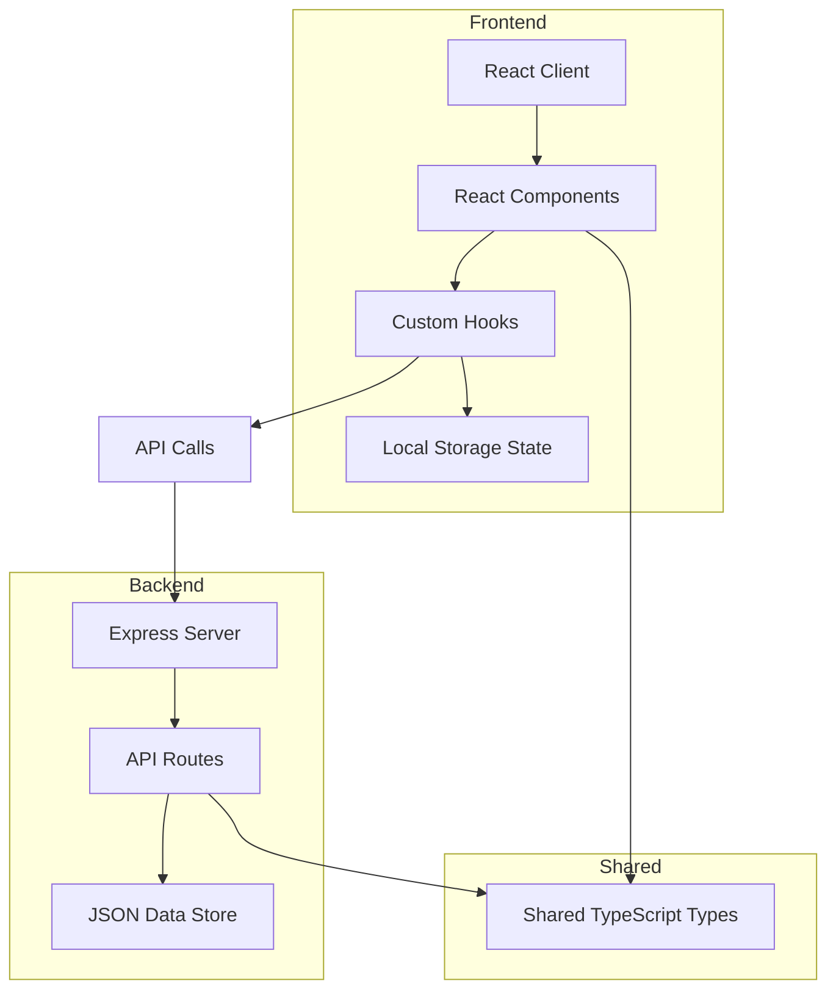
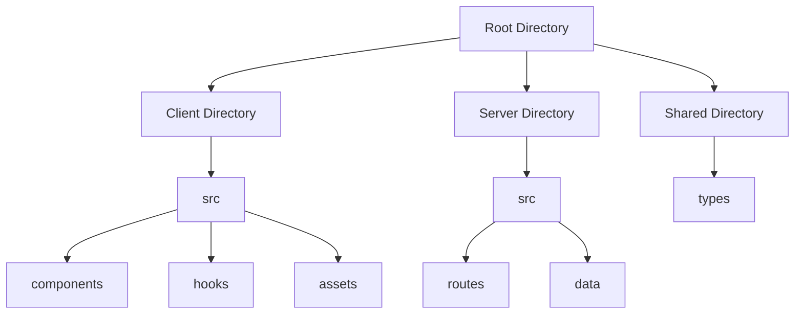
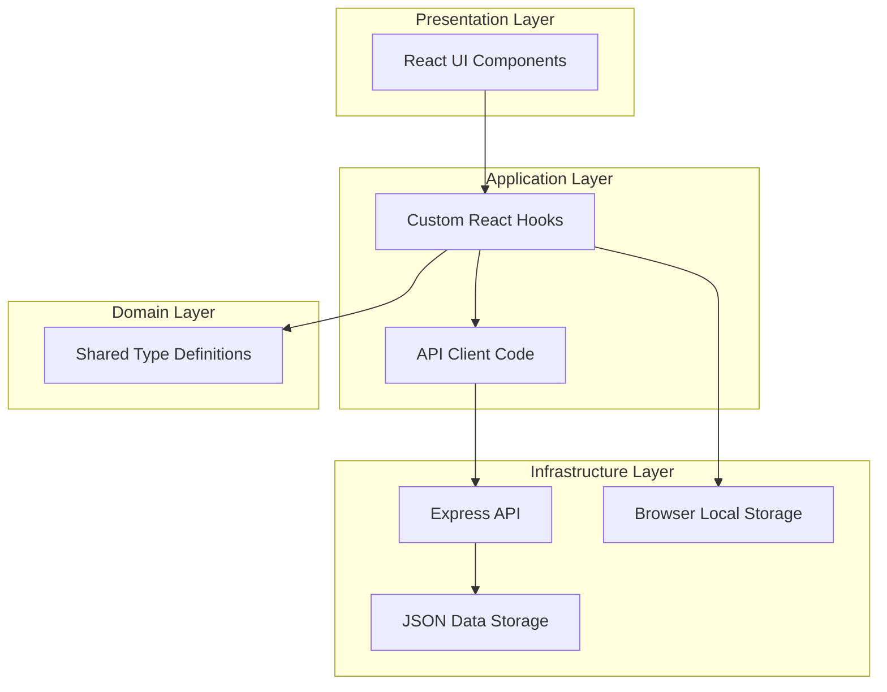

# Oblique Strategies Application - Repository Overview

This document provides a comprehensive analysis of the Oblique Strategies application codebase from multiple perspectives: developer, architect, and project manager.

## Table of Contents

1. [Project Overview](#project-overview)
2. [Technical Architecture](#technical-architecture)
3. [Codebase Analysis](#codebase-analysis)
4. [Developer's Perspective](#developers-perspective)
5. [Architect's Perspective](#architects-perspective)
6. [Project Manager's Perspective](#project-managers-perspective)
7. [Future Development Recommendations](#future-development-recommendations)

## Project Overview

The Oblique Strategies application is a full-stack web application that provides users with creative problem-solving prompts based on Brian Eno and Peter Schmidt's "Oblique Strategies" card deck. The application allows users to:

- View random strategy cards
- Mark strategies as favorites
- Search through the strategy collection
- Access a daily strategy that persists throughout the day

The application follows a client-server architecture with a React frontend and Express backend, both written in TypeScript.

## Technical Architecture

### Stack Overview

- **Frontend**: React 19 with TypeScript, Vite, TailwindCSS, React Router
- **Backend**: Express.js with TypeScript
- **Shared Types**: TypeScript interfaces shared between frontend and backend
- **State Management**: Local storage and React hooks (no external state library)
- **Styling**: TailwindCSS with custom color theme
- **Icons**: Heroicons library

## Codebase Analysis

### Project Structure

### Key Components

#### Backend

The server is built with Express.js and provides the following API endpoints:

- `GET /api/welcome`: A simple welcome message endpoint
- `GET /api/strategies`: Returns all strategies
- `GET /api/strategies/random`: Returns a random strategy
- `GET /api/strategies/:id`: Returns a specific strategy by ID

The strategies are stored in a JSON file and loaded into memory when the server starts.

#### Frontend

The frontend consists of several key components:

1. **StrategyView**: Main component displaying a random strategy
2. **StrategyCard**: Reusable component to display individual strategies
3. **FavoritesList**: Shows strategies marked as favorites
4. **SearchStrategy**: Allows users to search for specific strategies
5. **DailyReminder**: Shows a persistent daily strategy

Custom hooks:
- **useFavorites**: Manages favorite strategies in local storage
- **useDailyStrategy**: Manages the daily strategy with local storage persistence

## Developer's Perspective

### Code Quality

The codebase is well-structured and follows modern TypeScript and React best practices:

- **TypeScript Integration**: Proper type definitions with shared types between frontend and backend
- **Component Structure**: Follows component-based architecture with clean separation of concerns
- **Custom Hooks**: Encapsulates complex logic in reusable hooks
- **Modern React Patterns**: Uses functional components and React hooks throughout

### Development Experience

The project is set up with developer experience in mind:

- **Hot Module Replacement**: Vite provides fast reloading during development
- **TypeScript Compiler**: Configured for strict type checking
- **ESLint**: Code linting with React-specific rules
- **Tailwind CSS**: Utility-first CSS framework for rapid UI development

### Areas for Developer Improvement

1. **Testing**: No tests are currently implemented, which could be added with Jest and React Testing Library
2. **API Error Handling**: Error handling for API requests could be improved
3. **Loading States**: Better handling of loading states for async operations

## Architect's Perspective

### System Design

The application follows a clean architecture pattern:

### Architectural Patterns

1. **Shared Types**: Type definitions shared between frontend and backend ensure consistency
2. **Repository Pattern**: Server-side code follows a simple repository pattern for data access
3. **Container/Presentational Pattern**: React components follow this pattern, separating logic from presentation
4. **Custom Hooks**: Encapsulates business logic and state management

### Architectural Considerations

1. **Scalability**: The current JSON-based storage would need to be replaced with a database for production
2. **State Management**: Local React state and localStorage are sufficient for now, but a more robust solution like React Context or Redux might be needed as complexity grows
3. **API Design**: The API follows RESTful principles but lacks authentication or rate limiting

## Project Manager's Perspective

### Feature Completeness

The application delivers a complete set of core features:

- ✅ View random strategies
- ✅ Favorite strategies management
- ✅ Search functionality
- ✅ Daily strategy feature
- ✅ Responsive design

### Project Health

1. **Code Maintainability**: The codebase is well-structured and should be maintainable
2. **Dependencies**: Using modern, actively maintained libraries
3. **Technical Debt**: Minimal technical debt, primarily around testing and error handling

### Risk Assessment

| Risk | Impact | Likelihood | Mitigation |
|------|--------|------------|------------|
| No automated tests | Medium | High | Implement test suite with Jest and RTL |
| Local storage limitations | Low | Medium | Consider alternative storage solutions |
| JSON data store scalability | Medium | Low | Plan for database migration when needed |
| API error handling | Medium | Medium | Implement robust error handling |

## Future Development Recommendations

### Short-term Improvements

1. **Testing**: Add unit and integration tests
2. **Error Handling**: Improve error handling throughout the application
3. **Loading States**: Add proper loading indicators
4. **Accessibility**: Ensure the application is fully accessible

### Mid-term Enhancements

1. **User Accounts**: Add authentication to persist user data across devices
2. **Database**: Replace JSON storage with a proper database
3. **Progressive Web App**: Implement PWA features for offline usage
4. **Analytics**: Add usage analytics to understand user behavior

### Long-term Vision

1. **Mobile Applications**: Develop native mobile applications
2. **Advanced Features**: Add user-created strategies, sharing features
3. **Monetization**: Explore premium features or subscription model

## Conclusion

The Oblique Strategies application is a well-structured full-stack TypeScript project that demonstrates good software engineering practices. It provides a solid foundation that can be extended with additional features and improvements.

The application balances simplicity with functionality, making it both a useful tool for creative professionals and an excellent example of modern web development practices.

